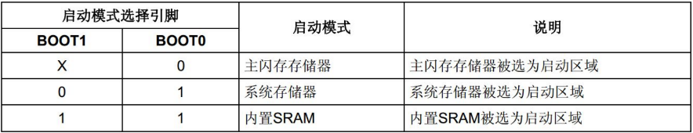

#### 启动模式

重启芯片是，在 sysclk 的第4个上升沿，boot 引脚的值将被锁存。

用户可通过手指 boot1 和 boot0 引脚的状态，来选择复位后的启动模式。

* boot0 = 0：flash memory 主闪存储存器

启动地址：0x08000000。从内置的 flash 启动，JTAG/SWD 模式下载程序就是下载到这里面。

* boot0 = 1, boot1 = 0：system memory 系统储存器

启动地址：0x1FFF0000。从内置的系统存储器启动，该区域（为ROM，出厂后不可修改）出厂内部预置了1段 bootloader，即 ISP 程序。

* boot0 = 1, boot1 = 1：static random access memory 静态随机存取存储器

启动地址：0x20000000。从内置 SRAM启动，该模式常用于程序调试。如代码修改了一小个地方，将 flash 全部擦除再写入就比较耗时，可考虑将程序下载到SRAM中。注：SRAM 掉电会丢失数据，即没有程序存储能力。

---

**启动地址**

CM3 规定 CPU 上电后是从 0 地址开始执行，flash memory 下的中断向量表却烧录再 0x0800 0000 处，上电是不就找不到中断向量表了？答：芯片一上电，Flash 上的 0x0800 0000 地址被映射到 0 地址处，不影响 CM3 内核的读取。

**Flash 锁死**

内部 Flash 锁死，无法连接 SWD 以及使用 JTAG 调试，可从从系统存储器启动（BOOT0=1，BOOT1=0），在该模式下，该模式下使用 SWD 和 JTAG 烧录程序完成后，切换为主闪存储存器启动即可（BOOT0=0，BOOT1=X）。

